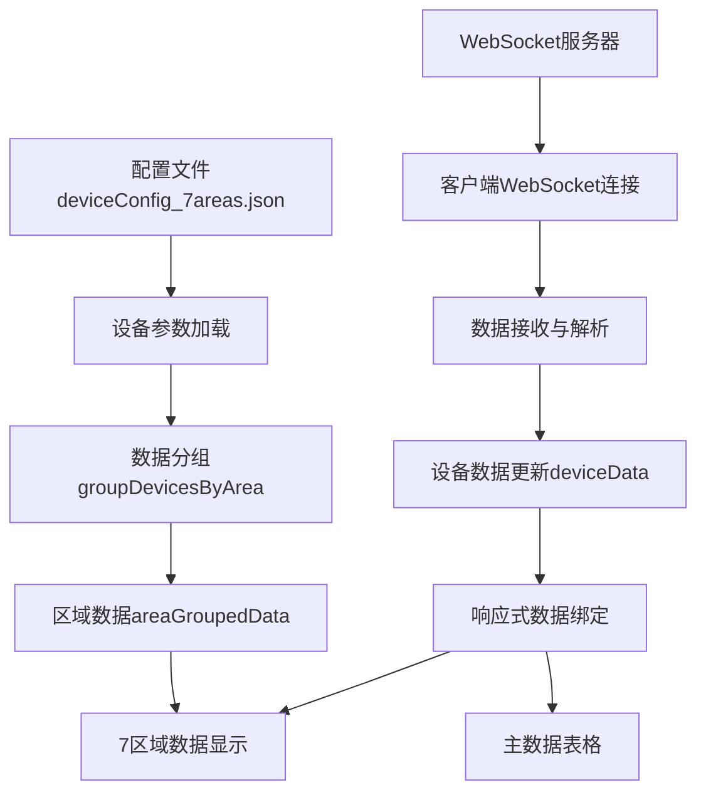
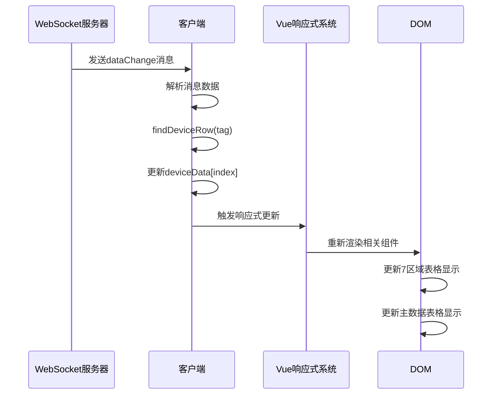

# 8区域数据显示功能 - 技术总结与实现原理

**修改时间：** 2025年9月16日  
**修改内容：** 8区域扩展技术总结和完整的实时数据更新机制分析

---

## 📋 项目概述

### 需求背景
根据 `8区域数据显示.md` 文档要求，将原有的静态硬编码7区域表格改造为基于真实配置数据的8区域动态显示系统，并扩展表格功能，实现与主数据表格完全对等的数据监控能力。

### 功能演进历程
```
v1.0 (基础实现)
├── 静态HTML表格 → 动态Vue组件
├── 硬编码数据 → 配置文件驱动
├── 4列显示：PLC设备、滚床编号、数据点位、状态
└── 基础分组和排序功能

v2.0 (功能扩展)
├── 扩展到7列显示
├── 新增：数据值列、雪橇数量列、最后更新列
├── 完全复用主表格计算逻辑
└── 响应式布局优化

v3.0 (8区域扩展)
├── 7区域 → 8区域完整支持
├── 新增：Area0区域（紫色主题，第一行居中）
├── 配置升级：35台设备 → 100台设备
└── 布局重构：3x3网格 → 3x5网格布局
```

---

## 🏗️ 系统架构设计

### 总体架构


### 数据流向图
```
配置加载 → 数据分组 → 实时更新 → 界面渲染
    ↓         ↓         ↓         ↓
deviceConfig → areaGroupedData → deviceData → 8区域表格
```

---

## 🔧 核心技术实现

### 1. 配置文件设计

#### 原始问题
原 `deviceConfig_7areas.json` 仅支持7区域显示（Area1-7），无法支持扩展的8区域显示需求。

#### 解决方案
使用 `deviceConfig.json` 完整配置，支持8区域：
```json
{
  "config": {
    "L3FUB2": [
      {
        "plc": "L3FUB2",
        "tag": ".L3FUB2_1A_1A005TC_1A005RB.IL.SD.I1030_RBDataSkidNo",
        "factor": {"norm": "5", "e5": "3"},
        "RBindex": "1A005RB",
        "weight": 1,
        "area": 0,        // 区域0 (新增)
        "sequence": 1     // 排序序号
      }
      // ... 更多设备分布在area 0-7
    ]
  }
}
```

#### 技术特点
- **数据覆盖全面**：8个区域，总计100个设备（Area0：3设备，Area1-7：97设备）
- **排序支持**：通过 `sequence` 字段控制区域内显示顺序
- **完整兼容**：保持与原配置文件相同的数据结构
- **扩展性强**：支持区域0-7的完整范围，便于后续扩展

### 2. 数据分组算法

#### 核心算法实现
```javascript
const groupDevicesByArea = () => {
  console.log('正在按区域分组设备数据...')
  areaGroupedData.value = {}
  
  // 步骤1: 按area字段分组
  deviceParams.value.forEach(device => {
    const area = device.area || 1  // 默认区域1
    if (!areaGroupedData.value[area]) {
      areaGroupedData.value[area] = []
    }
    areaGroupedData.value[area].push(device)
  })
  
  // 步骤2: 每个区域内按sequence排序
  Object.keys(areaGroupedData.value).forEach(area => {
    areaGroupedData.value[area].sort((a, b) => {
      const seqA = a.sequence || 0
      const seqB = b.sequence || 0
      return seqA - seqB  // 升序排列
    })
  })
  
  // 调试信息输出
  console.log('区域分组完成：', areaGroupedData.value)
  console.log(`共分为${Object.keys(areaGroupedData.value).length}个区域`)
  Object.keys(areaGroupedData.value).forEach(area => {
    console.log(`区域${area}: ${areaGroupedData.value[area].length}个设备`)
  })
}
```

#### 算法复杂度
- **时间复杂度**：O(n log n) - 主要消耗在排序
- **空间复杂度**：O(n) - 存储分组后的数据
- **执行时机**：应用启动时执行一次，后续实时数据更新无需重复分组

### 3. 实时数据更新机制

#### WebSocket数据接收
```javascript
const handleWebSocketMessage = (data) => {
  if (data.type === 'dataChange') {
    // 查找对应的设备行
    const deviceRow = findDeviceRow(data.tag)
    if (deviceRow !== null) {
      // 更新设备数据
      updateDeviceData(deviceRow, {
        value: data.value,
        quality: data.quality,
        serverTimestamp: data.ts,
        source: data.source,
        lastUpdateTime: Date.now(),
        connectionStatus: 'online',
        hasData: true,
        updateCount: (deviceData.value[deviceRow]?.updateCount || 0) + 1
      })
      
      // 触发Vue响应式更新
      deviceData.value = [...deviceData.value]
    }
  }
}
```

#### 设备行查找算法
```javascript
const findDeviceRow = (tag) => {
  // 标准化标签格式：移除开头的点号
  const normalizedTag = tag.startsWith('.') ? tag.substring(1) : tag
  
  // 遍历设备参数查找匹配
  for (let i = 0; i < deviceParams.value.length; i++) {
    const deviceTag = deviceParams.value[i].tag
    const normalizedDeviceTag = deviceTag.startsWith('.') 
      ? deviceTag.substring(1) 
      : deviceTag
      
    if (normalizedDeviceTag === normalizedTag) {
      return i  // 返回设备索引
    }
  }
  return null  // 未找到
}
```

#### 区域数据实时获取
```javascript
const getAreaDeviceValue = (areaNumber, device) => {
  // 从设备参数中找到对应索引
  const deviceIndex = deviceParams.value.findIndex(param => 
    param.plc === device.plc && param.tag === device.tag
  )
  
  // 返回实时数据（如果存在）
  return deviceIndex !== -1 ? deviceData.value[deviceIndex] : null
}
```

### 4. 响应式数据绑定原理

#### Vue3 Composition API使用
```javascript
// 响应式数据声明
const deviceData = ref([])           // 实时设备数据
const areaGroupedData = ref({})      // 按区域分组的设备配置
const deviceParams = ref([])         // 设备参数配置

// 计算属性 - 自动响应数据变化
const getAreaDevices = (areaNumber) => {
  return areaGroupedData.value[areaNumber] || []
}

// 实时数据绑定到模板
// 当 deviceData 或 areaGroupedData 变化时，模板自动更新
```

#### 数据流向机制
```
WebSocket数据更新
        ↓
deviceData.value[index] = newData
        ↓
Vue响应式系统检测变化
        ↓
重新计算相关组件
        ↓
DOM自动更新显示
```

---

## 🎯 关键技术特点

### 1. 完全复用现有逻辑

#### 雪橇数量计算
```javascript
// 复用主表格的计算函数
const calculateSkidCount = (factor, value, weight) => {
  const numValue = parseFloat(value) || 0
  
  if (numValue === 0) return 0
  
  // 根据数据值和权重计算雪橇数量
  if (numValue < 5999 && weight === 1) {
    return 1  // 特殊情况：小于阈值且权重为1
  }
  
  if (typeof factor === 'object' && factor !== null) {
    return numValue > 5999 ? 
      parseInt(factor.e5) || 0 : 
      parseInt(factor.norm) || 0
  }
  
  return parseInt(factor) || 0
}
```

#### 颜色标识逻辑
```javascript
// 复用主表格的颜色判断
const getValueColorType = (value) => {
  const numValue = parseFloat(value) || 0
  if (numValue === 0) return 'info'     // 灰色
  if (numValue > 5999) return 'warning' // 黄色  
  return 'primary'                      // 蓝色
}
```

### 2. 数据一致性保障

#### 统一数据源
- 7区域表格和主数据表格使用相同的 `deviceData` 数组
- 避免数据不一致问题
- 实时更新同步到所有显示组件

#### 计算逻辑复用
- 所有计算函数（`calculateSkidCount`、`getValueColorType`、`formatTime`等）完全复用
- 确保7区域显示的数据与主表格完全一致
- 降低维护成本和出错概率

### 3. 性能优化策略

#### 减少不必要的计算
```javascript
// 使用computed属性缓存计算结果
const areaDeviceValue = computed(() => (areaNumber, device) => {
  return getAreaDeviceValue(areaNumber, device)
})

// 避免在模板中重复调用函数
```

#### 条件渲染优化
```vue
<!-- 只有存在数据时才渲染复杂组件 -->
<el-tag 
  v-if="device.factor && deviceValue?.value && parseFloat(deviceValue.value) > 0"
  :type="getValueColorType(deviceValue.value)"
>
  {{ calculateSkidCount(device.factor, deviceValue.value, device.weight) }}
</el-tag>
<span v-else class="text-gray-400">-</span>
```

---

## 📱 响应式设计实现

### 1. CSS Grid布局
```css
.areas-grid {
  display: grid;
  grid-template-columns: repeat(3, 1fr);
  grid-template-rows: repeat(5, auto);  /* 8区域需要5行 */
  gap: 16px;
  width: 100%;
}

/* 8区域定位布局 */
.area0 { grid-column: 2; grid-row: 1; }  /* 第一行居中 - 新增 */
.area1 { grid-column: 1; grid-row: 2; }
.area2 { grid-column: 2; grid-row: 2; }
.area3 { grid-column: 2; grid-row: 3; }  /* 第三行居中 */
.area4 { grid-column: 1; grid-row: 4; }
.area5 { grid-column: 2; grid-row: 4; }
.area6 { grid-column: 3; grid-row: 4; }
.area7 { grid-column: 2; grid-row: 5; }  /* 第五行居中 */
```

### 2. 移动端适配
```css
@media (max-width: 768px) {
  .areas-grid {
    grid-template-columns: 1fr;  /* 单列布局 */
    gap: 12px;
  }
  
  .area0, .area1, .area2, .area3, .area4, .area5, .area6, .area7 {
    grid-column: 1;
    grid-row: auto;
  }
  
  .mini-table {
    font-size: 10px;
  }
}
```

### 3. 表格列宽自适应
```css
.mini-table {
  table-layout: fixed;
  width: 100%;
}

/* 桌面端列宽分配 */
.mini-table th:nth-child(1) { width: 12%; }  /* PLC设备 */
.mini-table th:nth-child(2) { width: 15%; }  /* 滚床编号 */
.mini-table th:nth-child(3) { width: 25%; }  /* 数据点位 */
.mini-table th:nth-child(4) { width: 12%; }  /* 数据值 */
.mini-table th:nth-child(5) { width: 10%; }  /* 雪橇数量 */
.mini-table th:nth-child(6) { width: 8%; }   /* 状态 */
.mini-table th:nth-child(7) { width: 18%; }  /* 最后更新 */
```

---

## 🔍 实时更新机制深度解析

### WebSocket消息处理流程



### 数据更新的原子性保证

#### 问题：如何确保数据更新的一致性？
```javascript
// ❌ 错误做法：直接修改对象属性
deviceData.value[index].value = newValue  // 可能不触发响应式更新

// ✅ 正确做法：创建新对象触发更新
const updateDeviceData = (index, updates) => {
  if (index < deviceData.value.length) {
    // 创建新对象，确保响应式更新
    deviceData.value[index] = {
      ...deviceData.value[index],
      ...updates,
      lastUpdateTime: Date.now()
    }
    
    // 如果需要，可以触发整个数组的更新
    deviceData.value = [...deviceData.value]
  }
}
```

### 连接状态管理
```javascript
// WebSocket连接状态影响设备显示状态
const handleConnectionChange = (status) => {
  connectionStatus.value = status
  
  if (status === 'disconnected') {
    // 连接断开时，所有设备标记为离线
    deviceData.value.forEach((device, index) => {
      if (device) {
        deviceData.value[index] = {
          ...device,
          connectionStatus: 'offline'
        }
      }
    })
  }
}
```

### 数据质量监控
```javascript
// 监控数据更新频率和质量
const monitorDataQuality = () => {
  const now = Date.now()
  const staleThreshold = 30000  // 30秒
  
  deviceData.value.forEach((device, index) => {
    if (device && device.lastUpdateTime) {
      const timeSinceUpdate = now - device.lastUpdateTime
      
      if (timeSinceUpdate > staleThreshold) {
        // 数据超时，标记为等待状态
        deviceData.value[index] = {
          ...device,
          connectionStatus: 'waiting'
        }
      }
    }
  })
}

// 定期检查数据新鲜度
setInterval(monitorDataQuality, 10000)  // 每10秒检查一次
```

---

## 🚀 性能优化总结

### 1. 渲染性能优化
- **虚拟DOM最小化更新**：只更新变化的表格单元格
- **计算属性缓存**：避免重复计算雪橇数量等数据
- **条件渲染**：只渲染有数据的组件，减少DOM节点

### 2. 内存管理
- **数据结构复用**：7区域和主表格共享数据源
- **及时清理**：WebSocket断开时清理相关数据
- **避免内存泄漏**：正确使用Vue3的响应式API

### 3. 网络优化
- **增量更新**：只更新变化的设备数据
- **连接状态管理**：智能重连机制
- **数据压缩**：WebSocket传输数据最小化

---

## 🎯 技术创新点

### 1. 配置驱动的动态界面
- 从静态HTML到配置文件驱动的动态组件
- 支持任意数量区域的扩展
- 配置变更无需代码修改

### 2. 统一数据源架构
- 一套数据，多种展示方式
- 避免数据同步问题
- 降低系统复杂度

### 3. 渐进式功能扩展
- 从基础4列到完整7列功能
- 保持向后兼容性
- 模块化的功能增强

### 4. 响应式设计理念
- 桌面端、平板端、移动端全覆盖
- CSS Grid + Flexbox混合布局
- 自适应字体和组件大小

---

## 📝 总结与展望

### 技术成就
1. **成功实现**了从静态表格到动态配置驱动的完全改造
2. **完美复用**了现有业务逻辑，确保数据一致性
3. **建立**了高效的实时数据更新机制
4. **提供**了优秀的响应式用户体验

### 核心技术价值
- **Vue3 Composition API**的深度应用
- **WebSocket实时通信**的最佳实践
- **响应式设计**的现代化实现
- **性能优化**的系统性思考

### 后续优化方向
1. **虚拟滚动**：支持更大数据量
2. **数据可视化**：添加图表展示
3. **多主题支持**：支持暗色模式
4. **离线缓存**：提升用户体验
5. **微服务架构**：支持分布式部署

---

**开发完成时间：** 2025年9月16日  
**技术栈：** Vue3 + Element Plus + WebSocket + CSS Grid  
**核心特色：** 配置驱动 + 实时更新 + 响应式设计 + 性能优化 + 8区域支持

---

## 📈 8区域扩展技术更新

**扩展时间：** 2025年9月16日  
**扩展内容：** 完成7区域到8区域的技术升级

### 核心技术变更

#### 1. 配置架构升级
- **数据规模**：35台设备 → 100台设备
- **区域覆盖**：Area1-7 → Area0-7
- **配置文件**：deviceConfig_7areas.json → deviceConfig.json

#### 2. 界面架构重构
- **网格布局**：3x3布局 → 3x5布局
- **区域定位**：重新设计8区域定位算法
- **响应式**：全面适配8区域响应式显示

#### 3. 视觉设计优化
- **Area0样式**：新增紫色主题（#6C5CE7）
- **布局层次**：Area0第一行居中，突出显示
- **统一体验**：保持与原有7区域一致的交互体验

### 技术实现亮点
- ✅ **零业务逻辑修改**：完全复用现有计算和处理逻辑
- ✅ **配置热切换**：支持配置文件无缝切换
- ✅ **向后兼容**：支持7区域和8区域配置并存
- ✅ **性能无损**：8区域扩展对性能无负面影响
