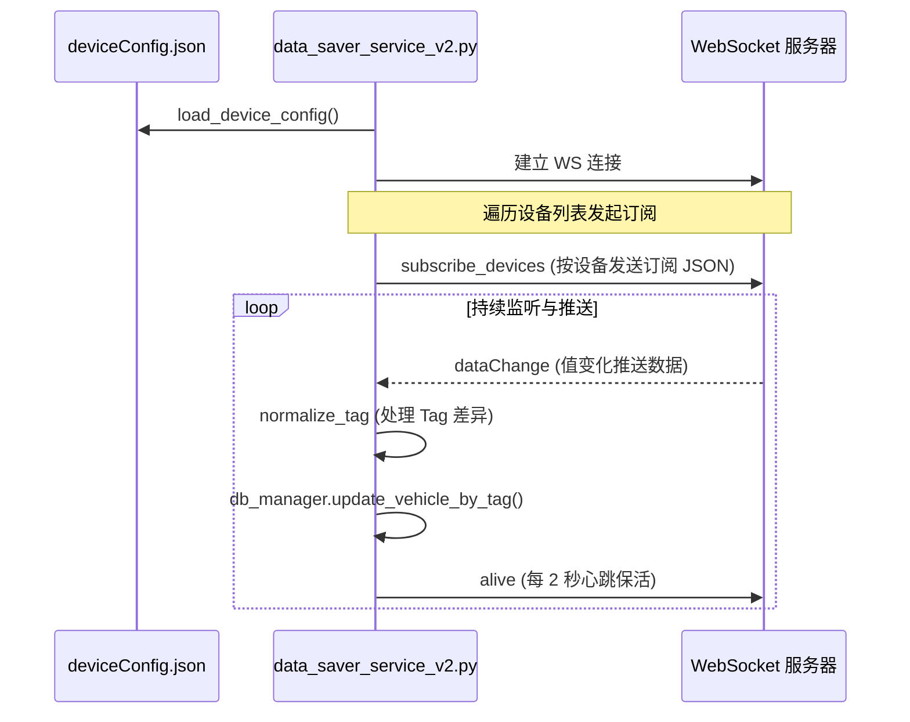

# WebSocket 数据订阅机制分析报告

## 一、 整体订阅流程



---

## 二、 客户端/服务器交互格式

### 1. 订阅消息格式 (客户端 -> 服务器)
在 `subscribe_devices()` 中针对每个采集点发送：
```json
{
  "id": "",
  "type": "advise",
  "plc": "L3F13",
  "tag": ".L3F13_1A_1A015LT_1A015RB.IL.SD.M1003_BodyID"
}
```
* **id**: 消息 ID (当前留空)
* **type**: 固定为 `"advise"`，表示注册变更通知
* **plc**: PLC 节点名
* **tag**: 具体数据块路径（以 `.` 开头）

### 2. 心跳/保活 (客户端 -> 服务器)
每隔 `HEARTBEAT_INTERVAL` (2 秒) 发送：
```json
{
  "type": "info", 
  "info": "alive"
}
```

### 3. 服务器返回的数据推送 (服务器 -> 客户端)
当数据变化时，服务器推送 `dataChange` 消息：
```json
{
  "type": "dataChange",
  "tag": "L3F13.L3F13_1A_1A015LT_1A015RB.IL.SD.M1003_BodyID",
  "value": "12345678901234VS21J2LA1MLB01000",
  "ts": "2026-03-18T19:08:21.123Z"
}
```
* **tag**: **特别注意**：返回的 Tag 格式为 `PLC名.路径` (无前导点)。
* **value**: **30 字节定长**的车身原始字符串。

---

## 三、 30 字节原始数据 (Value) 结构定义

推送的 `value` 为固定 30 字符长度，对应数据库 `rb_position_data` 的各字段解析：

| 字节范围 | 字段名 | 说明 |
| :--- | :--- | :--- |
| 0 - 13 | `vehicle_id` | 车身唯一标识 (14 位) |
| 14 - 18 | `body_type` | 车身类型代码 (5 位) |
| 19 - 22 | `color_code` | 颜色代码 (4 位) |
| 23 - 25 | `platform_code` | 车型平台代码 (3 位) |
| 26 | `black_roof_flag`| 黑色车顶标志 (1 位) |
| 27 | `rework_flag` | 返工标志 (1 位) |
| 28 | `reserved_1` | 预留字段 1 (1 位) |
| 29 | `reserved_2` | 预留字段 2 (1 位) |

---

## 四、 Tag 格式化逻辑 (Normalize Tag)

为了实现从 WebSocket 服务器接收信息并更新本地数据库，客户端需完成 Tag 格式的归一化转换：

1. **源格式 (服务器)**: `PLC名称.路径` (例: `L3F13.L3F13_1A_...`)
2. **目标格式 (数据库)**: `.路径` (例: `.L3F13_1A_...`)

**转换逻辑说明 (`normalize_tag`)**:
* 找到第一个 `.` 字符。
* 丢弃 `.` 之前的部分 (PLC 名称)。
* 在剩余部分前添加 `.` 前缀。
* 这样才能在数据库表的 `tag` 索引中通过 `WHERE tag = ?` 找到对应位置。

---

## 五、 订阅失败/重连机制

1. **重连**: 最大重连次数 `10` 次，重连间隔 `5` 秒。
2. **批量订阅**: 每订阅 10 个 Tag 强制休眠 0.1 秒，防止短时间内对服务器产生大量订阅负载。
3. **数据校验**: 若接收到的 `value` 长度不等于 30 字符，会记录警告并跳过该次数据库更新。
